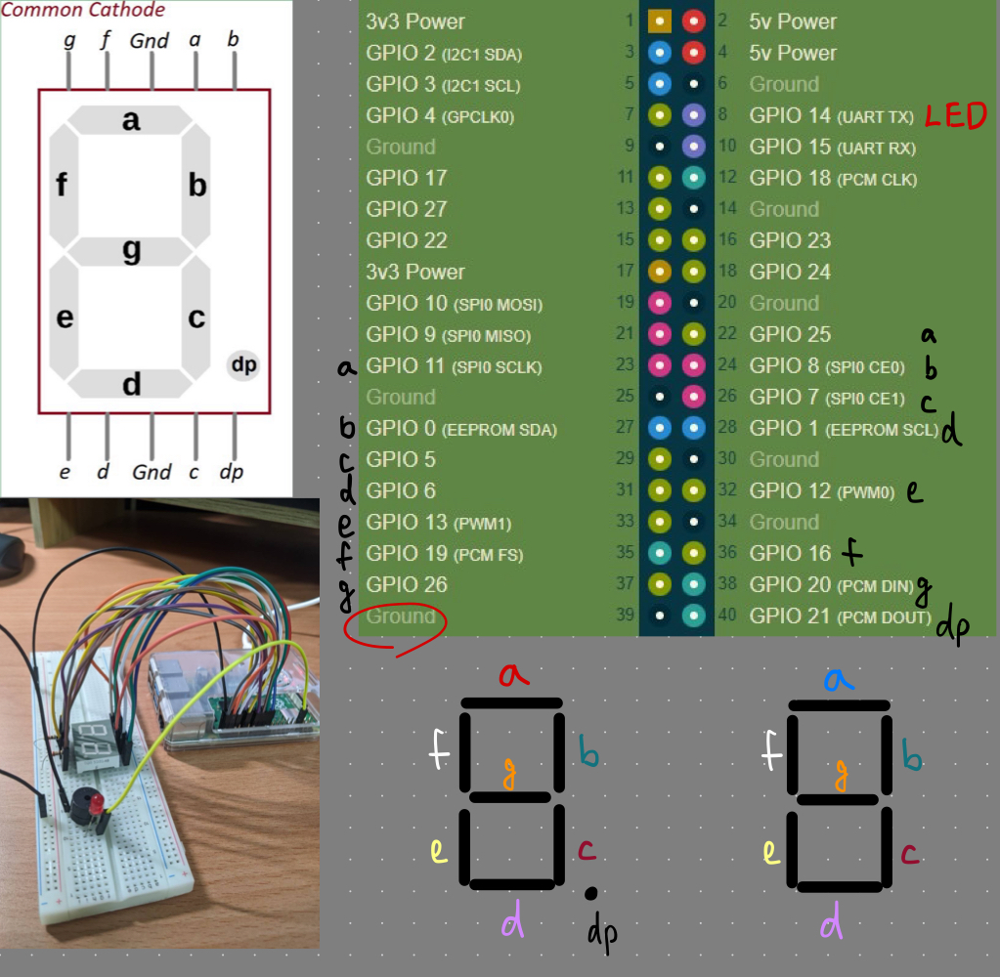
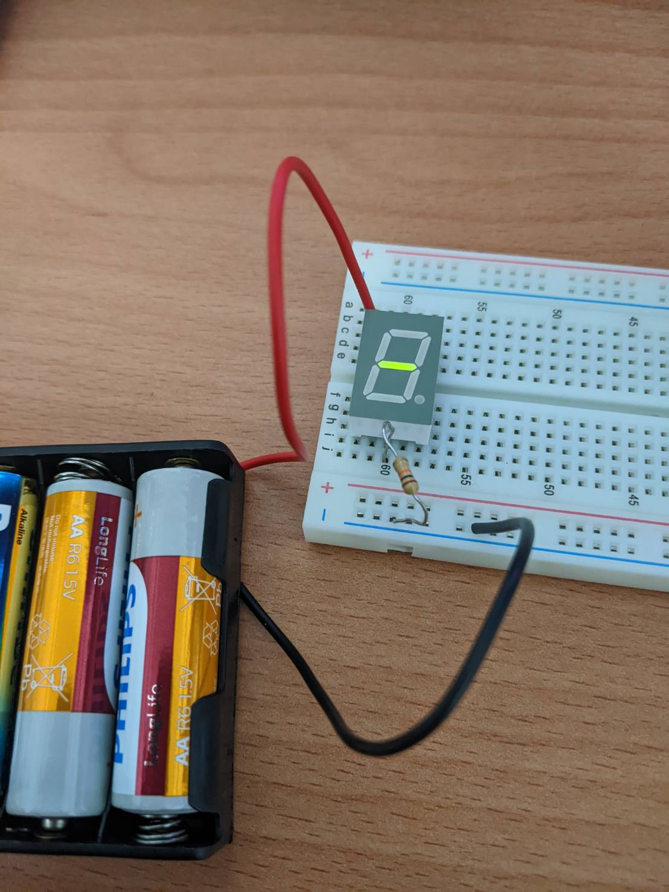

# HW1 - Raspberry Pi & 7-Segment Display

## Wiring

## Task 1 - Display & Read Input
The source code is in **hw_task.py** , using RPi.GPIO  
Identified the two 7-segment dislay are both **Common Cathode (CC)**.  

Demo video: https://youtube.com/shorts/FcWIsOccVfQ?feature=share
* Stage 1: display + LED demo
* Stage 2: input + output  
=> input 7,  output 7  
=> input 999,  invalid so LED on  
=> input 84, output 84  
=> input 3.5, output 3.5

## Task 2 - Stretch Ideas
The source code is in **little_game.py** , using RPi.GPIO  
How to Play:   
